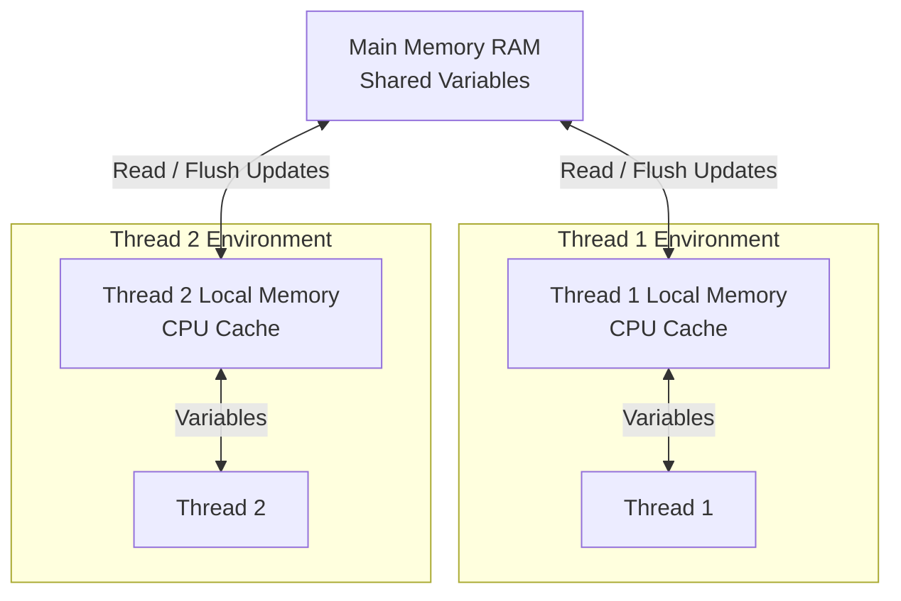

## How can a Map be sorted in Java?

Using TreeMap.

## Main difference in java 17 and java 8

Java 8:
- Lambda expressions
- Functional interfaces
- Streams API
- Optional class
- Default & static methods in interfaces

Java 17:
- Records → concise data classes
```
record User(String name, int age) {}
```
- Sealed classes -> restrict inheritance
- Pattern matching for instanceof
```
if (obj instanceof String s) { }
```
- Text blocks
```
String text = """Hello, 
World!""";
```
- Switch expressions
```
switch (x) { case 1 -> "One"; case 2 -> "Two"; default -> "Other"; }
```
- Performance Improvements
  - Better JVM optimizations
  - New garbage collectors: G1 improved (default), ZGC (low-latency), Shenandoah
  - Java 17 is significantly faster and more memory-efficient in real systems.
- Security & Encapsulation
  - Java 8: Weak module boundaries
  - Java 17: Strong encapsulation via JPMS (Java Platform Module System, introduced in Java 9)
  - Internal APIs are no longer easily accessible (safer but may break old code)
- Module System
  - Not present in Java 8
  - Introduced in Java 9, fully part of Java 17

- API Enhancements
  - New methods in String, Optional, Stream
  - HttpClient (modern replacement for HttpURLConnection)
  - Improved collectors
  - Files API improvements

## Runnable vs Callable

The main differences between `Runnable` and `Callable` are:

- **Return Value**: `Runnable`'s `run()` method returns `void` (no result), whereas `Callable`'s `call()` method returns a generic value `V`.
- **Exception Handling**: `Runnable` cannot throw checked exceptions (no `throws` clause in `run()`). In contrast, `Callable` can throw checked exceptions because its `call()` method has a `throws Exception` clause.
- **Introduction**: `Runnable` was introduced in Java 1.0, while `Callable` was introduced in Java 1.5.

**Where they are used:**
- Use **Runnable** for executing concurrent background tasks where a result or status isn't needed (e.g., background polling, logging).
- Use **Callable** for concurrent tasks where you need the result returned, or when the task can throw checked exceptions. It's commonly used with `ExecutorService`.

**Basic Implementation:**
> ```java
> // Runnable implementation
> class MyRunnable implements Runnable {
>     @Override
>     public void run() {
>         System.out.println("Runnable is running");
>     }
> }
> 
> // Runnable Usage
> Thread thread = new Thread(new MyRunnable());
> thread.start();
> ```
> 
> ```java
> // Callable implementation
> import java.util.concurrent.Callable;
> import java.util.concurrent.ExecutorService;
> import java.util.concurrent.Executors;
> import java.util.concurrent.Future;
> 
> class MyCallable implements Callable<String> {
>     @Override
>     public String call() throws Exception {
>         boolean errorOccurred = true; // Simulate some condition
>         if (errorOccurred) {
>             throw new Exception("An error occurred during execution");
>         }
>         return "Callable result";
>     }
> }
> 
> // Callable Usage
> ExecutorService executor = Executors.newSingleThreadExecutor();
> Future<String> future = executor.submit(new MyCallable());
> 
> try {
>     String result = future.get(); // blocks until result is available
>     System.out.println(result);
> } catch (java.util.concurrent.ExecutionException e) {
>     // Exceptions thrown inside Callable are wrapped in ExecutionException
>     System.out.println("Callable threw an exception: " + e.getCause().getMessage());
> } catch (InterruptedException e) {
>     e.printStackTrace();
> } finally {
>     executor.shutdown();
> }
> ```

## How is strip better than trim
### trim() (Java 8)
- Removes only ASCII whitespace
- Works based on characters ≤ U+0020 (space, tab, newline, etc.)
- Fails for many Unicode spaces

### strip() (Java 11+, available in Java 17)
- Uses Unicode-aware whitespace detection
- Based on Character.isWhitespace()

## == vs equals()
- `==` is an **operator** that compares memory references (i.e., whether two variables point to the exact same object in memory).
- `equals()` is a **method** that compares the actual logical content (value) of the objects, assuming the class overrides the method (like `String` does).
```java
String s1 = new String("Java");
String s2 = new String("Java");

System.out.println(s1 == s2);      // false (different memory locations)
System.out.println(s1.equals(s2)); // true (same logical text)
```

## How HashMap works internally
A `HashMap` stores Key-Value pairs using an array of "buckets" (Nodes).
1. **Hashing**: When you call `put(key, value)`, it calculates the `hashCode()` of the key to generate an integer.
2. **Index Calculation**: It uses this hash combined with the array size to pick a bucket index.
3. **Storing**: It places a Node containing `[Hash, Key, Value, Next Node Reference]` at that index.

## Collision handling (LinkedList vs Tree in Java 8+)
A **collision** occurs when two distinct keys yield the exact same bucket index.
- **Before Java 8**: Collisions were managed by creating a **LinkedList** at that index. Searching a long list had slow performance: `O(n)`.
- **Java 8+**: If a single bucket's LinkedList grows beyond **8 elements** (and the overall map holds at least 64 items), Java automatically upgrades it into a **Balanced Red-Black Tree**, drastically reducing search time to `O(log n)`.

## Load factor reasoning (0.75)
The **load factor** controls when the `HashMap` automatically resizes (usually doubling) its bucket array.
- **Why exactly 0.75?** It is the optimal mathematical sweet spot.
  - A **higher** load factor (e.g., 1.0) saves memory but dramatically increases collisions, slowing down reads/writes.
  - A **lower** load factor (e.g., 0.5) eliminates collisions but wastes massive amounts of memory due to frequent array resizing.

## Java Memory Model (JMM)
The JMM defines how threads interact through memory and dictates rules about visibility, ordering, and synchronization.
**Core Concept**: Threads do not always write directly to the "Main Memory" (RAM). Mostly, they read/write to their own hidden high-speed **CPU Caches** (Local Memory), which can cause other concurrent threads to temporarily read stale/old values!


> *Note: The `volatile` Java keyword forces a thread to bypass its Local Memory and read/write directly to Main Memory, ensuring other threads immediately see the updated value.*

## Thread safety & concurrency
**Thread Safety** means your code functions perfectly even when multiple threads execute it simultaneously without data corruption.
- **Race conditions**: Happen when two threads try to update the same variable simultaneously, blindly overwriting each other's changes.
- **How to prevent it**:
  1. **`synchronized` block / method**: Locks the block so only one thread can execute it at a time.
  2. **`volatile` keyword**: Solves visibility issues (ensures threads don't read "stale" values from their cache).
  3. **Concurrent Collections**: Use classes from `java.util.concurrent` (like `ConcurrentHashMap` or `AtomicInteger`) instead of standard collections, as they handle locking automatically and with far better performance than standard `synchronized` blocks.

## synchronized(className.class) vs synchronized(objectName.class)
- `synchronized(className.class)`: Locks the **Class Object** (Singleton lock). Only one thread can execute *any* synchronized method/block on that class at a time, regardless of how many instances exist.
- `synchronized(objectName.class)`: Locks the **Specific Instance** (Object lock). Only one thread can execute synchronized code on *that specific object* at a time. Other instances of the same class can be processed by other threads simultaneously.

## synchronized vs ReentrantLock vs ReadWriteLock

### 1. `synchronized`
- **What it is**: The fundamental base Java keyword that handles thread interference. When a thread enters a synchronized block on an object, no other thread can enter *any* synchronized block on that exact same object.
- **Inter-thread Communication (`wait()` and `notify()`)**:
  - `synchronized` is designed to work seamlessly with `wait()` and `notify()`.
  - **`wait()`**: Forces the thread to immediately release the lock it currently holds and go to "sleep" until another thread wakes it up.
  - **`notify()`**: Wakes up a *single* sleeping thread that is actively waiting on this object's lock (`notifyAll()` wakes them all). 
  > *Crucial rule: You can only call `wait()` or `notify()` securely from firmly **inside** a `synchronized` block!*
- **Limitations**: You cannot interrupt a waiting thread, it blocks forever until the lock is naturally released, and it does not guarantee fairness (a waiting thread could starve indefinitely).
- **When to use**: Simple, basic synchronization scenarios where massive performance control is not desperately needed.

### 2. `ReentrantLock`
- **What it is**: An advanced class from `java.util.concurrent.locks`. "Reentrant" literally means that if a thread already holds the lock, that identical thread can safely request the exact same lock *again* without deadlocking itself (it simply increments an internal counter).
- **Advanced Control Features**: 
  - **`tryLock()`**: You can dynamically attempt to grab the lock but give up immediately or after a set timeout if someone else holds it (e.g., `if (lock.tryLock(5, TimeUnit.SECONDS))`). This brilliantly solves infinite blocking.
  - **Fairness Policy**: You can pass `true` to the constructor (`new ReentrantLock(true)`) to aggressively guarantee that the longest-waiting thread gets the lock next.
- **When to use**: When you desperately need advanced timeouts, non-blocking lock checks, or strict "fairness" queue protocols.

### 3. `ReadWriteLock`
- **What it is**: It physically manages two discrete locks internally simultaneously: a **Read Lock** and a **Write Lock**.
- **How it works**: 
  - **Read Lock**: Multiple threads can hold this lock *simultaneously* (as long as no thread holds the Write lock). 
  - **Write Lock**: A completely exclusive lock. If a thread grabs the Write lock, no other thread is allowed to read *or* write.
- **When to use**: Highly read-intensive applications (e.g., a cache layer that realistically reads 1,000 times for every 1 write). It drastically skyrocketed performance by letting thousands of threads read concurrently, completely eliminating the reading bottleneck caused by standard `synchronized` blocks.

## Fail-fast vs Fail-safe Iterators
- **Fail-fast**: Used by standard collections (`ArrayList`, `HashMap`). If you modify a collection while iterating through it, the iterator instantly throws a `ConcurrentModificationException`. It works directly on the memory of the original collection.
- **Fail-safe**: Used by concurrent collections (`ConcurrentHashMap`, `CopyOnWriteArrayList`). These will **not** crash if the collection changes during iteration. They usually work by iterating over a snapshot/clone of the collection at the time the iterator was created.

## String Immutability and Multithreading
- **Why are they immutable?**: To enable the **String Pool** (saving highly valuable memory by making identical strings point to the same object) and for **Security** (safely storing SQL connections or passwords).
- **Multithreading Benefits**: Because a String can physically *never change* its value after creation, it is **100% thread-safe**. You can pass a String safely across hundreds of threads without writing a single `synchronized` block. If a thread attempts to alter the String, it is forced to create a brand new String object instead.

## ForkJoinPool and Work-Stealing
- **How it works**: Designed for multi-processor efficiency using "Divide and Conquer". It breaks a massive task down into tiny subtasks (**Fork**), runs them across available CPU cores, and combines the results (**Join**).
- **Work-Stealing**: If a thread finishes its subtasks early, it doesn't sit idle. It "steals" pending tasks from the queues of other busy threads, ensuring maximum CPU utilization.
- **When to use**: CPU-intensive algorithms that can be recursively split (e.g., Image processing, sorting enormous arrays). *Do not use it for I/O bound tasks like database or API blocking calls.*

## Java Streams (Filter, Map, Reduce & Parallel)
- **Functional Processing**: Instead of manually writing `for` loops with complex `if` statements, Streams allow you to declaratively state *what* you want to achieve (`filter()` bad data, `map()` it to a new format, `reduce()` it to a sum).
- **Lazy Evaluation**: Stream operations are aggressively ignored until a **Terminal Operation** is invoked. If you filter a billion items but never trigger a terminal operation, absolutely zero execution happens.
- **Sequential vs Parallel**: By default, streams are sequential (single-threaded). Appending `.parallelStream()` chunks the massive data set and processes it concurrently utilizing the CPU's default `ForkJoinPool`.

## Intermediate vs Terminal Operations in Streams
- **Intermediate Operations**: They return *another Stream*, allowing infinite chaining. Because of lazy evaluation, they do nothing until a terminal triggers the chain. 
  - *Examples*: `filter()`, `map()`, `sorted()`, `distinct()`.
- **Terminal Operations**: They return a non-stream physical result (like a `List`, `int`, or just `void`). Calling this immediately executes the entire chained pipeline.
  - *Examples*: `collect()`, `forEach()`, `reduce()`, `count()`.

## Immutability in Java
- **What it is**: An object is completely immutable if its physical state cannot mathematically be altered after it is constructed.
- **How to create securely**:
  1. Make the class `final` so it cannot be extended/overridden.
  2. Make all fields strictly `private final`.
  3. Provide absolutely zero `setter` methods.
  4. If the class holds a mutable object (like a `Date` or `List`), ALWAYS return a **deep clone** of it in your getters, never the original memory reference.
- **Benefits**: 100% thread-safe intrinsically, fantastic for caching, and hyper-safe for use as `HashMap` keys.

## Volatile keyword and thread visibility
- **The Problem**: Threads drastically boost performance by caching variables heavily into their local CPU Cache rather than slowly reading from RAM. This triggers a **Visibility Problem**: Thread A updates a variable, but Thread B never visually sees the change because Thread B is still reading from its own outdated CPU cache.
- **The Fix (`volatile`)**: Adding `volatile` to a variable forcefully commands every thread to read it DIRECTLY from Main Memory (RAM), aggressively bypassing the local CPU cache entirely.
- *Crucial Note:* `volatile` guarantees **visibility**, but it DOES NOT guarantee **atomicity** (you still absolutely need `AtomicInteger` to safely increment a number like `i++`).

## Transient keyword (Serialization)
- **What it is**: During Serialization (converting a Java object into a byte stream to send over a network socket or save to disk), any variable marked with `transient` is completely ignored and aggressively skipped.
- **Why use it?**: 
  - **Security/Privacy**: Passwords, SSNs, or highly secret API keys should never be hard-written to a local disk file.
  - **Logical Meaninglessness**: Variables that dynamically have no mathematical meaning if loaded later (like a current network socket connection or an open database session handle).

## Functional Interfaces and Lambda expressions
- **Functional Interface**: An explicitly simple interface that has precisely **one abstract method**. Usually marked with `@FunctionalInterface` (e.g., `Runnable`, `Callable`, `Comparator`).
- **Lambda Expressions**: Introduced heavily in Java 8, they are simply an ultra-short syntactic sugar shortcut precisely meant to provide an immediate implementation for that *single* abstract method without writing a gigantic boilerplate Anonymous Inner Class.
  - *Before*: `Runnable r = new Runnable() { public void run() { System.out.println("Hi"); } };`
  - *After Lambda*: `Runnable r = () -> System.out.println("Hi");`

## Shallow Copy vs Deep Copy
- **Shallow Copy**: Creates a brand new Object, but lazily copies over the exact same *memory references* inside of it. If Object A holds a pointer to a `List`, the clone Object B will point to that exact same shared `List`. If B modifies the `List`, A gets mutated too! (The default `clone()` method is Shallow).
- **Deep Copy**: Recursively duplicates *everything*. It creates a brand new Object A, and dynamically creates a brand new perfectly duplicated `List` to put inside it. Changes made natively to clone B have mathematically zero impact on Object A.

## Stack vs Heap Memory
- **Stack Memory**: Tiny, incredibly fast localized memory. It strictly securely stores primitive values (`int`, `boolean`) and exact memory *references* (pointers) to objects. Follows LIFO (Last-In-First-Out). Every individual thread physically gets its own isolated, completely private Stack.
- **Heap Memory**: Massive, universally shared global memory space utilized strictly for storing dynamically created Objects (`new Object()`, `new ArrayList()`). The Heap is inherently accessible by all threads (which is exactly why concurrency issues exist here) and is intelligently managed recursively by the **Garbage Collector**.

## Comparable vs Comparator
In Java, both interfaces are explicitly used for sorting collections (like an `ArrayList`), but they operate fundamentally differently:

### 1. Comparable (Natural Ordering)
- **What it is**: It defines the singular, "default" or "natural" way your object should be predictably sorted. 
- **Implementation**: It fundamentally modifies the **actual target class** natively. Your class physically implements `Comparable<T>` and explicitly overrides the `compareTo(T target)` method.
  - *Example*: `public class Employee implements Comparable<Employee> { ... }`
- **When to use**: When the object has an overwhelmingly obvious default sort parameter (like strictly sorting an Employee universally by their `employeeId`).
- **The Core Drawback**: You are hardcoding exactly **one** permanent sorting behavior into the class. If you use `Comparable`, you cannot magically sort Employees by descending Salary in one UI view and alphabetically by Name in another.

### 2. Comparator (Custom Ordering)
- **What it is**: A totally external sorting mechanism that defines a dynamic, **custom rule** for ordering.
- **Implementation**: It is written physically **outside** of your target class. It implements `Comparator<T>` and dictates the logic inside the `compare(T obj1, T obj2)` method.
  - *Modern Example*: `Comparator<Employee> bySalary = (e1, e2) -> Double.compare(e1.getSalary(), e2.getSalary());`
- **When to use**: When you desperately need total dynamic flexibility. You can freely create 10 distinct `Comparator` objects (Sort by Age, Sort by Name, Sort by Start Date) without ever modifying the original `Employee` class source code.
- **Critical Logic Principle**: You **must** universally use a `Comparator` when you explicitly need to sort third-party classes generated from an external `.jar` file, precisely because you physically cannot edit their class files to add a `Comparable` interface!