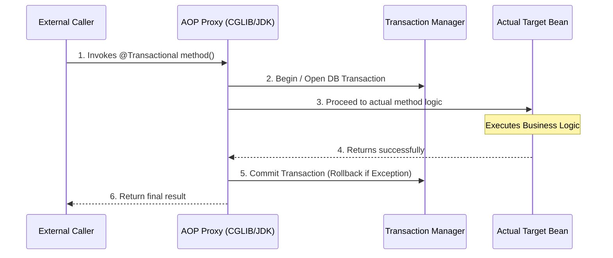

## What is the latest Spring Boot version?

**Current latest stable:**
- Spring Boot 4.0.4 (latest patch release)

**Key Highlights of Spring Boot 4:**
- Built on Spring Framework 7
- Supports modern Java versions (Java 17 onwards, including Java 25+)
- Better modularization (smaller, cleaner dependencies)
- Improved native support (GraalVM)
- First-class API versioning & HTTP clients
- Strong focus on cloud-native and observability

**Version Timeline:**
- Spring Boot 2.x: Legacy (Java 8 era)
- Spring Boot 3.x: Java 17 baseline
- Spring Boot 4.x: Latest generation (2025+)

**What should you use?**
- New projects: Spring Boot 4.x (recommended)
- Existing apps on 2.x/3.x: Upgrade gradually (breaking changes introduced in 4.x)

**Interview One-Liner:**
> "The latest Spring Boot version is 4.x, which is built on Spring Framework 7 and supports modern Java versions with improved modularity, performance, and cloud-native features."

**Further topics to cover:**
- Spring Boot 3 vs 4 differences
- Migration steps (2.x -> 3 -> 4) for real projects

## @Component vs @Service vs @Repository
- **`@Component`**: The most generic stereotype annotation. It tells Spring, "Manage this class as a Bean."
- **`@Service`**: Used in the business logic layer. Behaviorally, it is exactly the same as `@Component`, but it serves to make the developer's intent clear (Domain-Driven Design).
- **`@Repository`**: Used in the Data Access (DAO) layer. **Unlike the others**, it adds extra behavior: it automatically catches platform-specific database exceptions (like `SQLException`) and translates them into Spring's unified, unchecked `DataAccessException`.

## Bean scopes and lifecycle
**Primary Scopes:**
- **Singleton (Default)**: Only *one* shared instance is created per Spring container. Best for stateless beans.
- **Prototype**: A brand new instance is created *every single time* the bean is requested.
- **Web Scopes**: `Request` (one per HTTP request), `Session` (one per HTTP session), `Application` (one per ServletContext).

**Lifecycle (Simplified):**
1. **Instantiation**: Spring creates the object using its constructor.
2. **Populate Properties**: Spring injects dependencies (`@Autowired`).
3. **Initialization**: Methods annotated with `@PostConstruct` run.
4. **Active/Ready**: The bean is fully operational.
5. **Destruction**: Methods annotated with `@PreDestroy` run right before the application shuts down.

## Startup process of Spring Boot
When you trigger `SpringApplication.run()`:
1. **Context Creation**: Spring figures out the application type (e.g., standard app vs. Web app) and creates the `ApplicationContext`.
2. **Environment Setup**: It loads `application.properties` / `application.yml`, environment variables, and system properties.
3. **Component Scan**: It scans your root package for all stereotype annotations (`@Component`, `@Controller`, etc.).
4. **Auto-Configuration**: (The Magic Step) It evaluates `@EnableAutoConfiguration`. Spring actively checks what is on your classpath (e.g., if Tomcat is present, it instantly configures an embedded Tomcat server).
5. **Bean Instantiation**: Instances are created and dependencies are wired up based on the graph.
6. **Embedded Server Startup**: Starts the embedded web server (like Tomcat on port 8080).
7. **Runners Execution**: Executes any beans implementing `CommandLineRunner` or `ApplicationRunner`.

## Internals of @Transactional and pitfalls
**How it works internally:**
Spring implements this using **AOP (Aspect-Oriented Programming) Proxies**. When you invoke a `@Transactional` method, you do not talk to your actual target class directly; you talk to a Spring-generated "Proxy" class holding it.

**Which proxy does Spring use?**
1. **CGLIB Proxy (Default in modern Spring Boot)**: Used generally, or if your class does **not** implement an interface. Spring uses CGLIB to dynamically create a *subclass* of your target class at runtime. The subclass overrides your methods and wraps them in database transaction logic.
2. **JDK Dynamic Proxy**: Used primarily if your class implements an interface (and CGLIB is optionally disabled). Spring creates an object that implements that exact interface and intercepts calls.

**Execution Flow:**

**Common Pitfalls:**
- **Self-Invocation (The Biggest Trap):** If Method A calls Method B within the *same class*, and Method B is `@Transactional`, the transaction will **NOT** run. Why? Because you bypassed the proxy. `@Transactional` only triggers when called from an *external* class.
- **Checked Exceptions:** By default, `@Transactional` only rolls back for **RunTimeExceptions**. It will still *commit* if a Checked Exception (like `IOException`) happens, unless you explicitly tell it not to: `@Transactional(rollbackFor = Exception.class)`.
- **Private/Protected methods:** `@Transactional` only works on `public` methods. If slapped on a `private` method, it gets completely ignored silently.

## What is the difference between @Bean and @Component?
- **@Component** is a *class-level* annotation. It relies on Spring's automatic component scanning. You use it when you own the source code and can place the annotation directly on top of your class definition.
- **@Bean** is a *method-level* annotation mostly used inside `@Configuration` classes. It tells Spring, "Here is a method that manually instantiates and configures an object; please register what is returned as a Bean."
- **The Core Logic**: You **must** use `@Bean` when dealing with third-party libraries (like configuring a customized `ObjectMapper` or external `DataSource`) because you cannot physically edit the external `.jar` file to slap a `@Component` annotation natively on their class.

## How do filters, interceptors, and AOP differ in Spring Boot?
These are three layers of interception, ordered by how "deep" they operate:
1. **Filters** (Standard Java): They operate *outside* of Spring entirely. They intercept the raw HTTP request before it even reaches Spring's `DispatcherServlet`.
   - *Logic*: Use for generic, framework-agnostic web tasks (e.g., CORS handling, global logging, basic security) since they don't heavily rely on Spring Beans.
2. **Interceptors** (Spring MVC): They operate *inside* Spring, after the `DispatcherServlet` routes the request but before it hits your `@RestController`.
   - *Logic*: Use for Spring-specific pre-processing (e.g., checking user roles, parsing specific headers). They have full access to the Spring Context.
3. **AOP (Aspect-Oriented Programming)**: The deepest layer. It intercepts specific Java *local methods*, fully ignoring the HTTP layer.
   - *Logic*: Use for business-layer cross-cutting concerns (e.g., method execution time logging, Transaction management).

## What are the differences between ApplicationContext and BeanFactory?
- **BeanFactory**: The absolute bare-bones foundation container. It provides basic Dependency Injection and Instantiation.
  - *Logic*: It uses **Lazy Initialization** (beans are instantiated strictly when explicitly requested). It was originally meant for hyper-constrained environments (like old applets) where saving startup memory was critical.
- **ApplicationContext**: A complete superset of `BeanFactory` that adds robust enterprise-level features (Event publishing, Internationalization messaging, automatic BeanPostProcessor registration).
  - *Logic*: It uses **Eager Initialization** (instantiates all Singletons strictly at startup). It is infinitely better for modern applications because you immediately discover configuration errors during startup rather than triggering a runtime crash three hours later when a user executes a specific broken flow.

## How do you configure multiple data sources in Spring Boot?
Spring's auto-configuration normally configures exactly one `DataSource`. To configure two definitively, you must manually override the logic:
1. **Properties File**: Define separate properties in `application.yml` (e.g., `spring.datasource.primary` and `spring.datasource.secondary`).
2. **Manual Bean Creation**: Create a `@Configuration` class and manually instantiate two `DataSource` beans using `@Bean` bound strictly to `@ConfigurationProperties`.
3. **Entity & Transaction Managers**: You explicitly define a specific `EntityManagerFactory` and `PlatformTransactionManager` independently for each specific `DataSource`.
4. **The Critical Logic (`@Primary`)**: You **must** annotate exactly one of your DataSources, EntityManagers, and TransactionManagers with `@Primary`. If you don't, Spring will fatally crash at startup because it will find duplicates and won't know which database to definitively use as the default fallback.

## How would you design a scalable REST API in Spring Boot for high traffic?
Designing for high traffic requires overcoming severe bottleneck issues and making the app horizontally scalable:
1. **Absolute Statelessness**: NEVER store session data in server memory (`HttpSession`). Use JWTs (JSON Web Tokens) or external stores like Redis. 
   - *Logic*: This allows a Load Balancer to confidently route a user's requests randomly to any active server without data loss.
2. **Asynchronous/Reactive Processing**: Consider using **Spring WebFlux** (Project Reactor) instead of standard Spring MVC (Tomcat). 
   - *Logic*: Tomcat is constrained by a thread-per-request model (hitting max threads quickly). WebFlux uses an Event Loop (like Node.js), allowing massive throughput using only a handful of threads, drastically cutting down CPU context-switching overhead.
3. **Implement Caching**: Put Redis in front of heavily hit endpoints (`@Cacheable`). 
   - *Logic*: If a complex database query calculates stats in 200ms, caching it to RAM permanently drops the latency to 2ms, absorbing massive traffic spikes effortlessly.
4. **Database Connection Pooling & Replication**: Standardize DB connections universally using HikariCP. Split the database into a Master (for writes) and multiple Read-Replicas (for reads) to distribute the load perfectly.
5. **Circuit Breakers for Resilience**: Apply **Resilience4J**. 
   - *Logic*: If an external microservice you depend on temporarily goes down, fail fast! Never let 10,000 internal threads hang unresponsively waiting for an external timeout, as that instantly cascades and destroys your own application.
